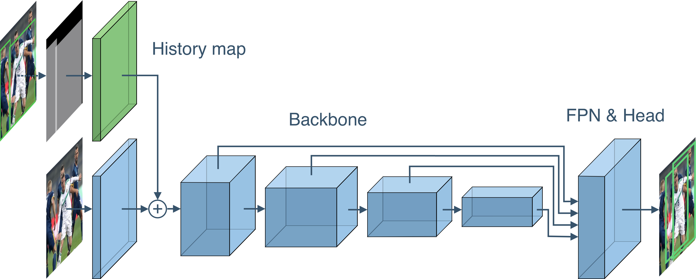
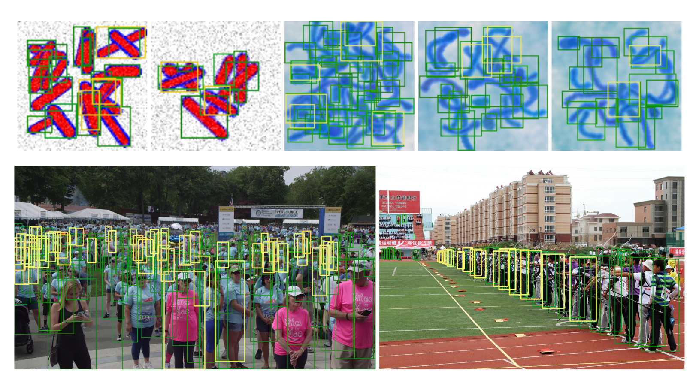

[](https://paperswithcode.com/sota/object-detection-on-crowdhuman-full-body?p=iterdet-iterative-scheme-for-objectdetection)
[](https://paperswithcode.com/sota/object-detection-on-widerperson?p=iterdet-iterative-scheme-for-objectdetection)

# IterDet: Iterative Scheme for Object Detection in Crowded Environments

This project hosts the code for implementing the IterDet scheme for object detection,
as presented in our paper:

> **IterDet: Iterative Scheme for Object Detection in Crowded Environments**<br>
> [Danila Rukhovich](https://github.com/filaPro),
> [Konstantin Sofiiuk](https://github.com/ksofiyuk),
> [Danil Galeev](https://github.com/denemmy),
> [Olga Barinova](https://github.com/OlgaBarinova),
> [Anton Konushin](https://scholar.google.com/citations?user=ZT_k-wMAAAAJ)
> <br>
> Samsung AI Center Moscow <br>
> https://arxiv.org/abs/2005.05708

<p align="center"></p>

### Installation

This implementation is based on [mmdetection](https://github.com/open-mmlab/mmdetection) framework.

<details>
 <summary>All our modifications against their `v2.0.0` release are listed below:</summary> 
 
 * configs/iterative/*
 * demo/iterative/*
 * mmdet/datasets/\_\_init\_\_.py
 * mmdet/datasets/pipelines/transforms.py
 * mmdet/datasets/pipelines/formating.py
 * mmdet/datasets/crowd_human.py
 * mmdet/models/dense_heads/anchor_head.py
 * mmdet/models/dense_heads/rpn_head.py
 * mmdet/models/roi_heads/bbox_heads/bbox_head.py
 * mmdet/models/backbones/resnet.py
 * mmdet/models/detectors/\_\_init\_\_.py
 * mmdet/models/detectors/iterdet_faster_rcnn.py
 * mmdet/models/detectors/iderdet_retinanet.py
 * tools/convert_datasets/crowd_human.py
 * tools/convert_datasets/toy.py
 * tools/convert_datasets/wider_person.py
 * requirements/runtime.txt
 
</details>

Please refer to original [install.md](docs/install.md) for installation.
Do not forget to update the original github repository link, and install [requirements.txt](requirements.txt).
For `v1.2.0` release follow `v1` branch.

[Config](configs/iterdet) files and [tools](tools/convert_datasets) 
for converting annotations to COCO format are provided for the following datasets:

 * AdaptIS [ToyV1](https://github.com/saic-vul/adaptis#toyv1-dataset) 
   and [ToyV2](https://github.com/saic-vul/adaptis#toyv2-dataset)
 * [CrowdHuman](https://www.crowdhuman.org/)
 * [WiderPerson](http://www.cbsr.ia.ac.cn/users/sfzhang/WiderPerson/)
 
### Get Started

Please see original [getting_started.md](docs/getting_started.md) for the basic usage examples.
Iterdet [configs](configs/iterdet) can be used for [train](tools/dist_train.sh) and [test](tools/dist_test.sh) scripts:

```shell script
bash tools/dist_train.sh configs/iterdet/crowd_human_full_faster_rcnn_r50_fpn_2x.py 8 --validate
bash tools/dist_test.sh configs/iterdet/crowd_human_full_faster_rcnn_r50_fpn_2x.py \
    work_dirs/iterdet/crowd_human_full_faster_rcnn_r50_fpn_2x/latest.pth 8
```
### Models

State-of-the-art models for all datasets are trained on top of Faster RCNN
based on ResNet-50. Metrics are given for 2 iterations IterDet inference.

| Dataset              | Download Link                                  | Recall | AP    | mMR   |
|:--------------------:|:----------------------------------------------:|:------:|:-----:|:-----:|
| AdaptIS Toy V1       | [toy_v1.pth][toy_v1]                           | 99.60  | 99.25 |       |
| AdaptIS Toy V2       | [toy_v2.pth][toy_v2]                           | 99.29  | 99.00 |       |
| CrowdHuman (full)    | [crowd_human_full.pth][crowd_human_full]       | 95.80  | 88.08 | 49.44 |
| CrowdHuman (visible) | [crowd_human_visible.pth][crowd_human_visible] | 91.63  | 85.33 | 55.61 |
| WiderPerson          | [wider_person.pth][wider_person]               | 97.15  | 91.95 | 40.78 |

[toy_v1]: https://github.com/saic-vul/iterdet/releases/download/v2.0.0/toy_v1_faster_rcnn_r50_fpn_2x.pth
[toy_v2]: https://github.com/saic-vul/iterdet/releases/download/v2.0.0/toy_v2_faster_rcnn_r50_fpn_2x.pth
[crowd_human_full]: https://github.com/saic-vul/iterdet/releases/download/v2.0.0/crowd_human_full_faster_rcnn_r50_fpn_2x.pth
[crowd_human_visible]: https://github.com/saic-vul/iterdet/releases/download/v2.0.0/crowd_human_visible_faster_rcnn_r50_fpn_2x.pth
[wider_person]: https://github.com/saic-vul/iterdet/releases/download/v2.0.0/wider_person_faster_rcnn_r50_fpn_2x.pth

### Example Detections

<p align="center"></p>
Examples of IterDet results on ToyV1, ToyV2, CrowdHuman (with full body
annotataions), and WiderPerson. The boxes found on the first and second iterations are
marked in green and yellow respectively.

### License

The code is released under the MPL 2.0 License.
MPL is a copyleft license that is easy to comply with.
You must make the source code for any of your changes available under MPL,
but you can combine the MPL software with proprietary code, 
as long as you keep the MPL code in separate files.

### Citation

If you find this work useful for your research, please cite our paper:

```
@article{rukhovich2020iterdet,
  title={IterDet: Iterative Scheme for Object Detection in Crowded Environments},
  author={Danila Rukhovich, Konstantin Sofiiuk, Danil Galeev, Olga Barinova, Anton Konushin},
  journal={arXiv preprint arXiv:2005.05708},
  year={2020}
}
```
